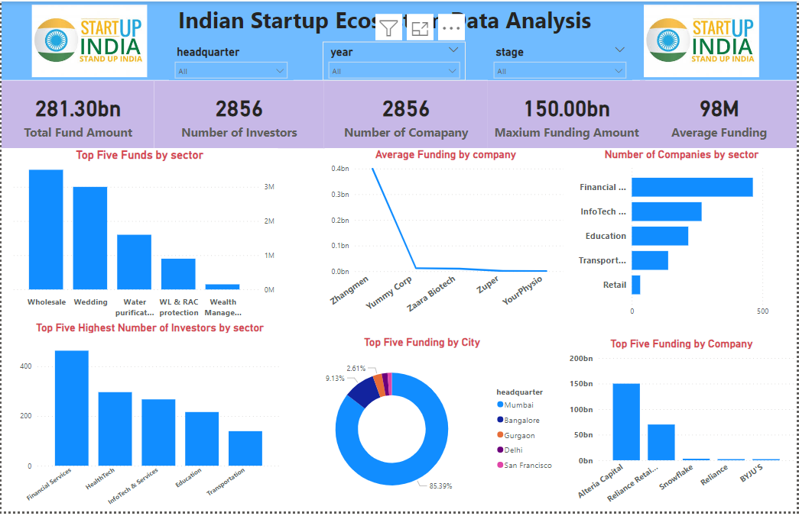

# Indian-start-up Data Analysis

 
 This Indian Startup Data Analysis Project is an initiative aimed at analyzing the funding received by start-ups in India from 2018 to 2021 and to investigate the India start-ups ecosystem and propose the best course of action while deriving insights into various aspects of start-ups in India, such as funding trends, industry distribution, geographical spread, and key players in the market. The analysis was done in Python and deployed in Power BI.

The project was done in python and deployed in Power Bi, using the provided data set gotten from three different source namely Database, One drive and GitHub Repository I connected to database from python to get the 2020 and 2021 dataset while 2018 and 2019 dataset was gotten from One drive and GitHub Repository respectively.

Following the CRISP-DM framework, having understood the objective of the project I develop the Hypothesis Statements, set up some analytical questions and embark on the data cleaning process of each of the dataset separately which take almost half of the time I spent on the project, after which I concatenated the datasets together and began the Exploratory data Analysis, then perform Hypothesis testing and move on to answer the analytical questions and then go to Power BI for Deployment. 

Project Structure:

Business Understanding: Define Objective of the project, Develop Hypothesis Statements, and Develop Analytical questions.

Data collection: Getting the dataset from three different source namely Database, One drive and GitHub Repository into Python.

Data Processing: The data collected undergoes cleaning, and structuring to ensure consistency, accuracy, and integrity. This step is crucial for preparing the data for analysis. 

Data Analysis: Analytics techniques, such statistical analysis, data exploration, and Hypothesis test, are applied to extract actionable insights and identify meaningful patterns and trends within the data.

Data Visualization: The findings from the analysis are communicated effectively through intuitive visualizations, including charts, graphs, and Interactive dash board, to communicate findings, facilitate understanding and decision-making.

Disclaimer:
The Indian Startup Data Analysis Project is intended for research and educational purposes only. The insights and findings generated through the analysis are not intended as financial, investment, or business advice. I encouraged everyone to conduct their own due diligence and consult with relevant experts before making any decisions based on this project's outputs.

